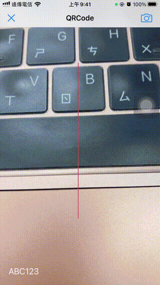

# WWScanViewController
[](https://developer.apple.com/swift/) [](https://developer.apple.com/swift/) [](https://developer.apple.com/swift/) [](https://developer.apple.com/swift/)

Use [AVFoundation Framework](https://developer.apple.com/documentation/avfoundation) to make a simple QRCode / BarCode scanner.

使用[AVFoundation Framework](https://developer.apple.com/documentation/avfoundation)做一個簡單的QRCode / BarCode掃瞄器。



### [Installation with Swift Package Manager](https://medium.com/彼得潘的-swift-ios-app-開發問題解答集/使用-spm-安裝第三方套件-xcode-11-新功能-2c4ffcf85b4b)
```
dependencies: [
    .package(url: "https://github.com/William-Weng/WWScanViewController.git", .upToNextMajor(from: "1.0.0"))
]
```

### Example
```swift
import UIKit
import WWPrint
import AVFoundation
import WWScanViewController

final class ViewController: UIViewController {
    
    @IBOutlet weak var qrCodeImageView: UIImageView!
    @IBOutlet weak var qrCodeLabel: UILabel!
    
    private let feedback = UIImpactFeedbackGenerator._build(style: .soft)
    private var scanViewController: WWScanViewController?
    
    override func viewDidLoad() {
        super.viewDidLoad()
    }
    
    override func prepare(for segue: UIStoryboardSegue, sender: Any?) {
        
        guard let scanViewController = segue.destination as? WWScanViewController else { return }
        
        scanViewController.configure(types: [.code39, .qr], delegate: self)
        self.scanViewController = scanViewController
    }
    
    @IBAction func startRunning(_ sender: UIBarButtonItem) {
        scanViewController?.startRunning()
    }
    
    @IBAction func stopRunning(_ sender: UIBarButtonItem) {
        scanViewController?.stopRunning()
    }
}

// MARK: - WWScanDelegate
extension ViewController: WWScanDelegate {
    
    func metadataOutput(_ result: Result<AVMetadataMachineReadableCodeObject, Error>) {
        
        switch result {
        case .failure(let error): wwPrint(error)
        case .success(let object):
            
            feedback._impact()
            
            qrCodeLabel.text = object.stringValue
            qrCodeImageView.translatesAutoresizingMaskIntoConstraints = true
            qrCodeImageView.frame = object.bounds
            
            switch object.type {
            case .qr:
                qrCodeImageView.image = #imageLiteral(resourceName: "QRCode")
                qrCodeImageView.backgroundColor = .clear
            case .code39:
                qrCodeImageView.image = nil
                qrCodeImageView.backgroundColor = .systemPink
            default: break
            }
        }
    }
}
```
